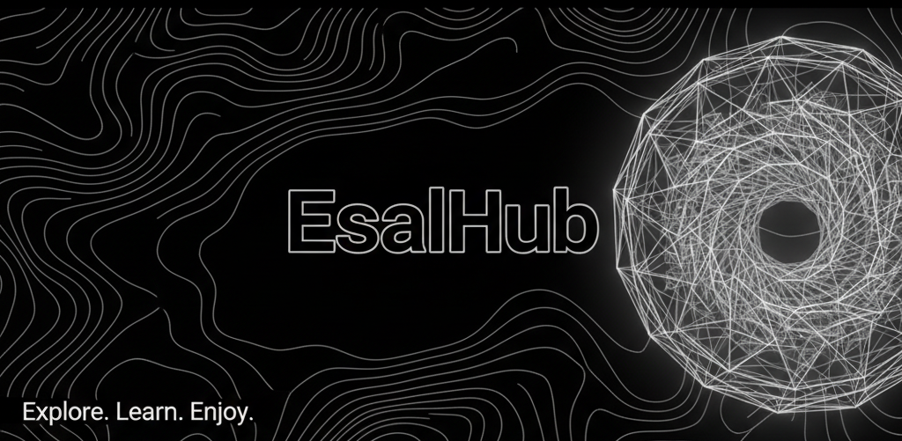

# ✨ Who am I?
I'm **Lase Oladejo**, a passionate Fullstack Web Developer who loves building awesome web applications.

# 🚀 What I Do

* 🔥 Fullstack web development (Frontend & Backend)
* 🎥 Create web coding repositories
* 💡 Love working with modern web technologies
* 🛠️ Always experimenting with new tools & frameworks

# 💻 Tech Stack
                    

💬 Let's Connect

* Instagram : <a href="https://www.instagram.com/_.just_esal._/" target="_blank">EsalHub</a>
* Email : <a href="mailto:tolusteady@gmail.com?subject=Collaboration%20Request" target="_blank">Send Email</a>
* GitHub : <a href="https://github.com/Pro-ridge4" target="_blank">Here!</a>

<picture>
  <source media="(prefers-color-scheme: dark)" srcset="https://raw.githubusercontent.com/asmrprog-yt/asmrprog-yt/output/github-snake-dark.svg" />
  <source media="(prefers-color-scheme: light)" srcset="https://raw.githubusercontent.com/asmrprog-yt/asmrprog-yt/output/github-snake.svg" />
  
</picture>